# Tests for EX1
in this file I will explain the tests that I wrote for the first exercise.

there are 6 main functions that I tested:
1. `loadGraph`
2. `isConnected`
3. `shortestPath`
4. `isContainsCycle`
5. `isBipartite`
6. `negativeCycle`

in each function I tested the function with different types of graphs:
* directed graph
* undirected graph

for the `shortestPath` function I tested the function with different types of graphs:
* unweighted graph
* weighted non-negative graph
* weighted negative graph

<hr>

### `loadGraph` for Directed Graph

will check if the `loadGraph` function works correctly for a directed graph.

there are 3 tests in this file:
1. test if the graph is loaded correctly
2. pass a non square matrix so the function should raise `invalid_argument` exception
3. pass a matrix that have a non `NO_EDGE` value on the main diagonal so the function should raise `invalid_argument` exception


### `loadGraph` for Undirected Graph
smae as the previous test but for an undirected graph.
in this test case I added a test to check if the matrix is symmetric or not.
so tets case 4 will pass a non symmetric matrix and the function should raise `invalid_argument` exception.


<hr>

### `isConnected` for Directed Graph
to check if a directed graph is connected or not.

we have 4 tests in this file:
1. this graph is connected, and looks like this:
```{.mermaid theme=forest}
graph LR;
    A-->B;
    B-->C;
```

2. this graph is not connected, and looks like this:
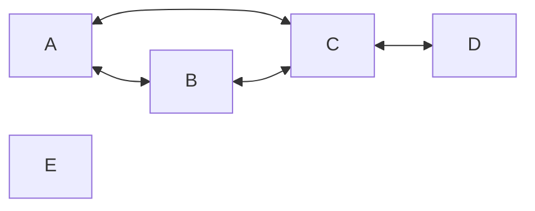

    we can see that the the node 4 is not connected to any other node.

1. a graph with a single node, so it should be connected.


4. a graph that a have one root, what he not the first node in the matrix (so the dfs will not start from him), the function should return true.
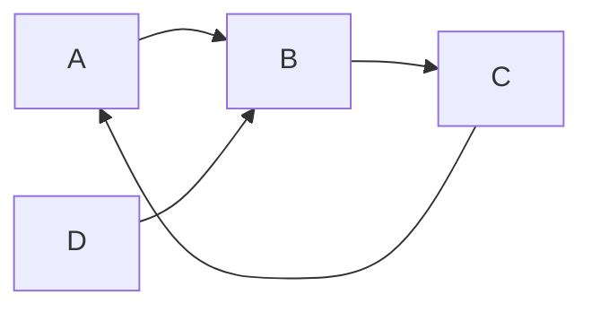

    in this graph the node `D` is the root, and the dfs will start from the node `A`.

### `isConnected` for Undirected Graph
in undirected graph the function should return true if the graph is connected, and false otherwise.

the test are very similar to the previous test, but the graph is undirected.

1. first connected graph:
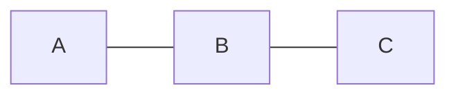

1. not connected graph:
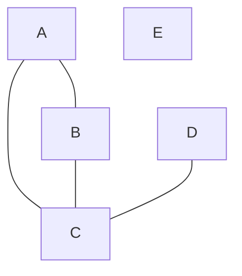

1. a graph with a single node, so it should be connected.

<hr>

### `shortestPath` for Directed Graph

#### unweighted graph

1. first graph:
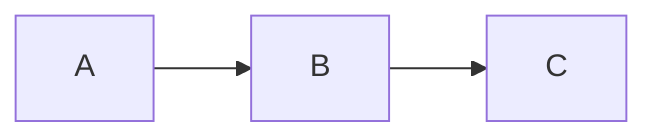

    the shortest path from `A` to `C` is `A -> B -> C`


2. second graph:
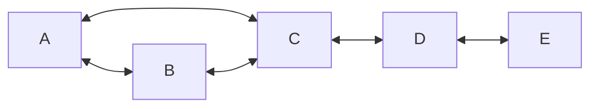

    the shortest path from `A` to `E` is `A -> C -> D -> E`
    the shortest path from `A` to itself is `A`

3. a graph with a no edge between the nodes, so there is no path between any two nodes.

#### weighted non-negative graph

1.

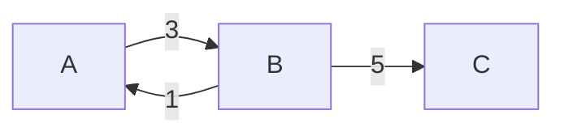

* the shortest path from `A` to `B` is `A -> B` with a cost of `3`
* the shortest path from `A` to `C` is `A -> B -> C` with a cost of `8`
* the shortest path from `B` to `C` is `B -> C` with a cost of `5`
* there is no path from `C` to `A`
* the shortest path from `A` to `A` is `A` with a cost of `0`

2.

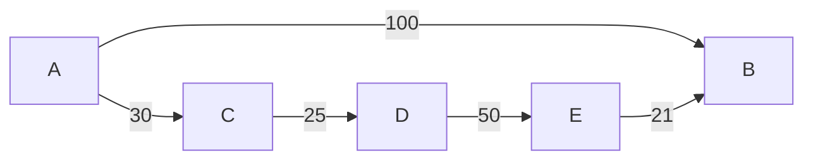
    the shortest path from `A` to `B` is `A -> B` with a cost of `100`

3. same graph as the previous one, but now (D,E)= 1 
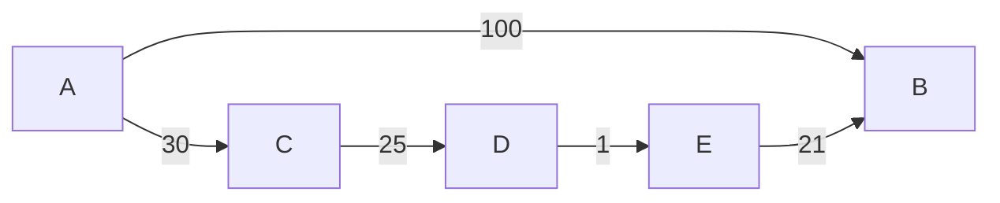
    the shortest path from `A` to `B` is `A -> C -> D -> E -> B` with a cost of `77`

#### weighted negative graph
1.

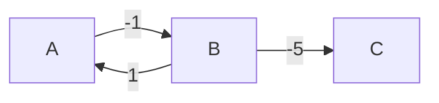

* the shortest path from `A` to `B` is `A -> B` with a cost of `-1`
* the shortest path from `A` to `C` is `A -> B -> C` with a cost of `-6`
* the shortest path from `B` to `C` is `B -> C` with a cost of `-5`
* there is no path from `C` to `A`
* the shortest path from `A` to `A` is `A` with a cost of `0`


2.
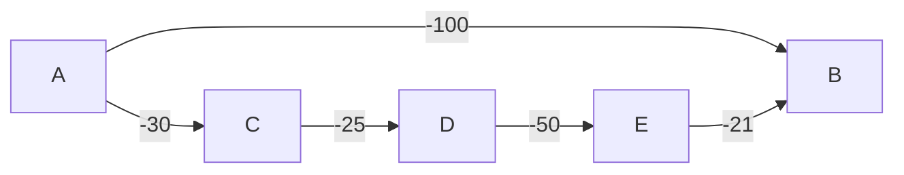

    the shortest path from `A` to `B` is `A -> C -> D -> E -> B` with a cost of `-226`

3. same as the previous one, but now (A,B) = -1000
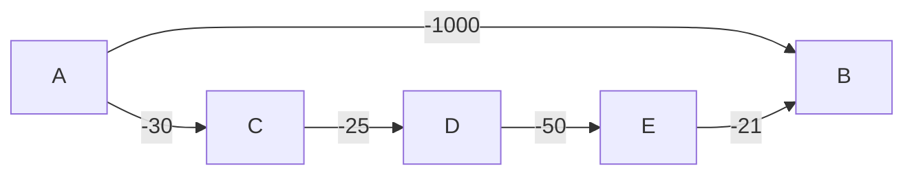

4. this graph will fail if we will run `dijkstra` algorithm, on him, but the bellman-ford will work correctly.

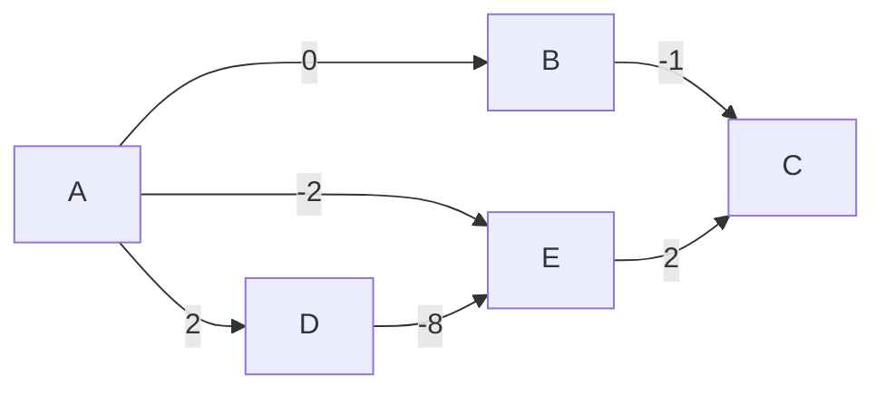


    the shortest path from `A` to `C` is `A -> D -> E -> C` with a cost of `-4`.


5. a graph with a negative cycle, so the function should raise an exception.
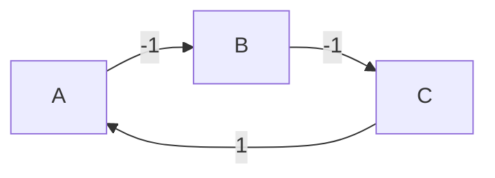

    the negative cycle is `A -> B -> C -> A`


<hr>

### `shortestPath` for Undirected Graph

#### unweighted graph
1. first graph:


* the shortest path from `A` to `B` is `A -> B`
* the shortest path from `A` to `C` is `A -> B -> C`
* the shortest path from `B` to `C` is `B -> C`
* there is no path from `C` to `A`
* the shortest path from `A` to `A` is `A`

2. second graph:
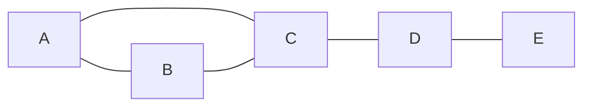

* the shortest path from `A` to `B` is `A -> B`
* the shortest path from `A` to `C` is `A -> C`
* the shortest path from `A` to `E` is `A -> C -> D -> E`

3. empty graph, so there is no path between any two nodes.

4. graph with 3 nodes, and just A and B are connected.
    
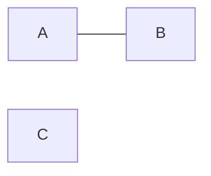

* there is no path from `A` to `C`
* the shortest path from `A` to `B` is `A -> B`
* there is no path from `B` to `C`
* the shortest path from `B` to `A` is `B -> A`


#### weighted non-negative graph

1. 
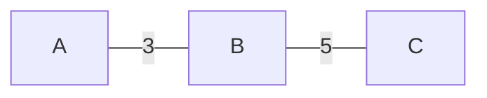

* the shortest path from `A` to `B` is `A -> B` with a cost of `3`
* the shortest path from `A` to `C` is `A -> B -> C` with a cost of `8`
* the shortest path from `B` to `C` is `B -> C` with a cost of `5`
* the shortest path from `C` to `A` is `C -> B -> A` with a cost of `8`
* the shortest path from `A` to `A` is `A` with a cost of `0`

2. 
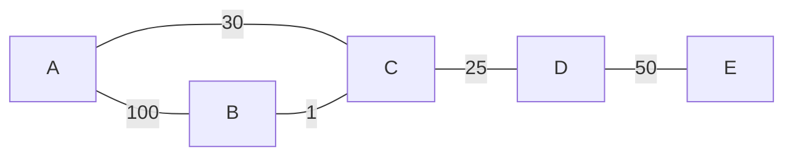

    the shortest path from `A` to `B` is `A -> C -> B` with a cost of `31`

3. same as the previous one, but now {B,C} = 1000
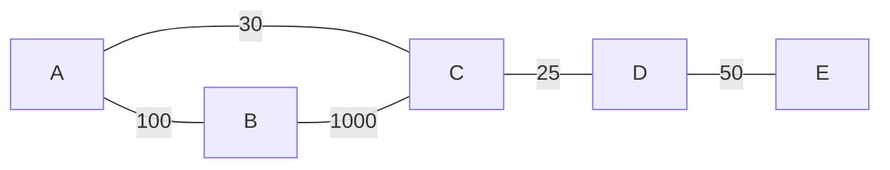
    
        the shortest path from `A` to `B` is `A -> B` with a cost of `100`

4. 
```mermaid
graph LR;
    A --- |100| B;
    A --- |30| C;
    B --- |9| E;
    C --- |10| D;
    D --- |50| E;
```

    the shortest path from `A` to `B` is `A -> C -> D -> E -> B` with a cost of `99`

5. same as the previous one, but now {B,E}=10

```mermaid
graph LR;
    A --- |100| B;
    A --- |30| C;
    B --- |10| E;
    C --- |10| D;
    D --- |50| E;
```

    the shortest path from `A` to `B` is `A -> B` with a cost of `100` or `A -> C -> D -> E -> B` with a cost of `100`

#### weighted negative graph
1. 
```mermaid
graph LR;
    A --- |10| B;
    B --- |-5| C;
    A --- |-1| C;
```


<hr>

#### `isContainsCycle` for Directed Graph

1. graph with a cycle of 3 nodes
```mermaid
graph LR;
    A --> B;
    B --> C;
    C --> A;
```

2. graph with a cycle of 3 nodes
```mermaid
graph LR;
    A --> B;
    B --> C;
    C --> D;
    D --> B;
```

3. graph with a cycle of 2 nodes, that dont start from the first node in the matrix
```mermaid
graph TD;
    A --> B;
    C --> D;
    D --> C;
    C --> A;
```

4. connected graph without a cycle
```mermaid
graph TD;
    A --> B;
    A --> C;
    B --> C;

```

#### `isContainsCycle` for Undirected Graph


<hr>


#### `isBipartite` for Directed Graph

#### `isBipartite` for Undirected Graph

<hr>

#### `negativeCycle` for Directed Graph

#### `negativeCycle` for Undirected Graph
