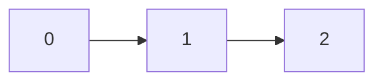
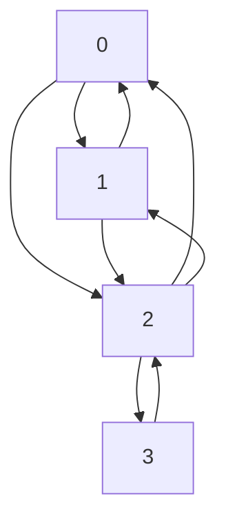

### `loadGraph` for Directed Graph

will check if the `loadGraph` function works correctly for a directed graph.

there are 3 tests in this file:
1. test if the graph is loaded correctly
2. pass a non square matrix so the function should raise `invalid_argument` exception
3. pass a matrix that have a non `NO_EDGE` value on the main diagonal so the function should raise `invalid_argument` exception

### `loadGraph` for Undirected Graph
smae as the previous test but for an undirected graph.
in this test case I added a test to check if the matrix is symmetric or not.
so tets case 4 will pass a non symmetric matrix and the function should raise `invalid_argument` exception.

### `isConnected` for Directed Graph
to check if a directed graph is connected or not.

we have 4 tests in this file:
1. this graph is connected, and looks like this:

2. this graph is not connected, and looks like this:
