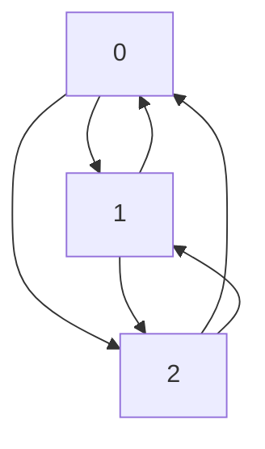

### loadGraph for DirectedGraph

will check if the `loadGraph` function works correctly for a directed graph.

there are 3 tests in this file:
1. test if the graph is loaded correctly

```mermaid
graph TD;
    A[0]-->B[1];
    A[0]-->C[2];
    B[1]-->A[0];
    B[1]-->C[2];
    C[2]-->A[0];
    C[2]-->B[1];
```